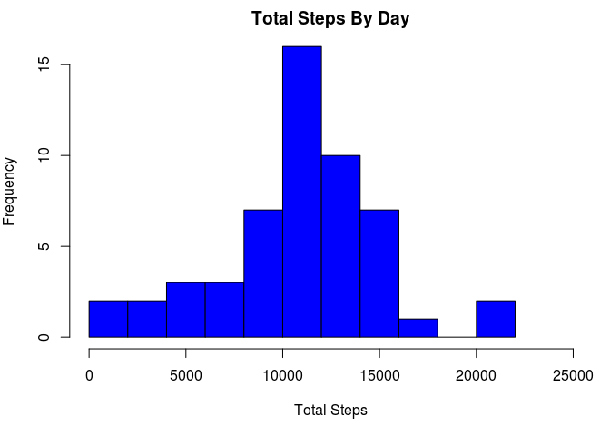
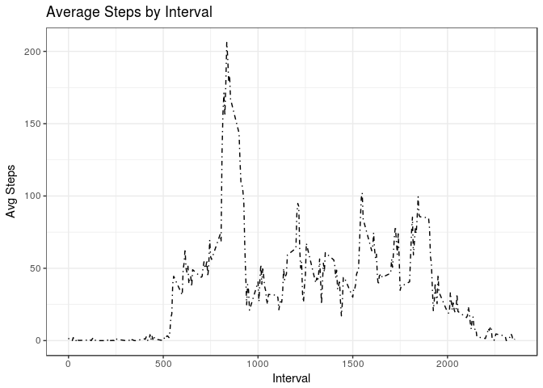
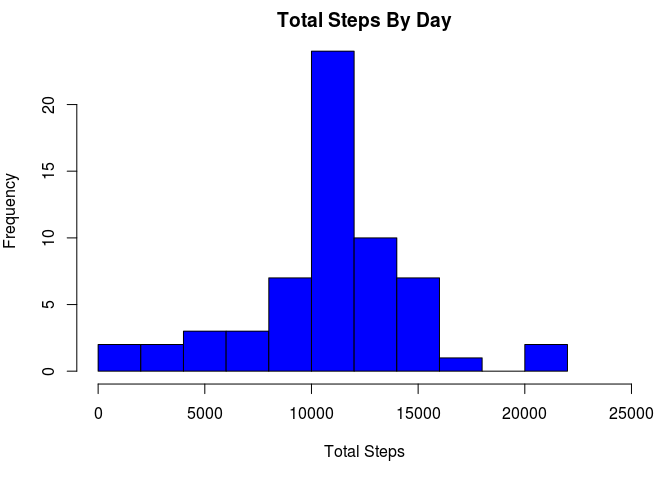
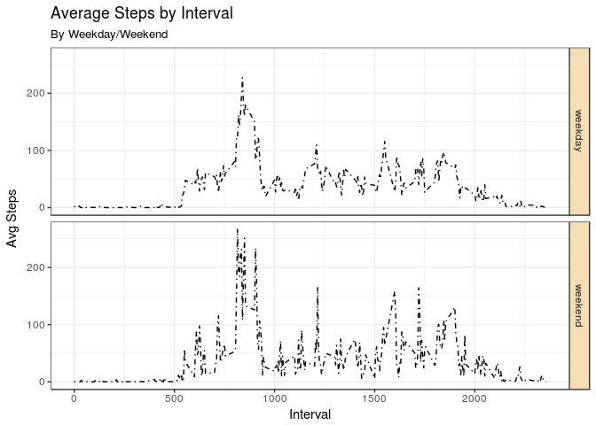

# Repro_Research_Week2
Chris Hunter  
7/23/2017  


  
##**Loading and preprocessing the data**
  

```r
library(dplyr)
```

```
## 
## Attaching package: 'dplyr'
```

```
## The following objects are masked from 'package:stats':
## 
##     filter, lag
```

```
## The following objects are masked from 'package:base':
## 
##     intersect, setdiff, setequal, union
```

```r
library(ggplot2)
# read data and ignore all NA values
act <- read.csv("./activity.csv")
act_no_na <- complete.cases(act)
act_good <- act[act_no_na,]

# Calculate total, mean, and median steps grouped by date
act_good_byDay <- select(act_good, steps, date) %>%
  group_by(date) %>%
  summarize(total_steps = sum(steps), mean_steps = mean(steps), 
            median_steps = median(steps))

# Calculate mean steps by 5 minute interval
act_good_byInt <- select(act_good, steps, interval) %>%
  group_by(interval) %>%
  summarize(mean_steps = mean(steps))
```
  
--------
        
##**What is mean total number of steps taken per day?**  
  

```r
par(mar = c(5, 4, 2, 1))
hist(act_good_byDay$total_steps, col = "blue", xlab = "Total Steps", 
     main = "Total Steps By Day", breaks = 10, xlim = c(0, 25000))
```

<!-- -->

```r
knitr::kable(act_good_byDay[,c(1,3,4)], caption = "Mean and Median Steps Per Day")
```


Table: Mean and Median Steps Per Day

date          mean_steps   median_steps
-----------  -----------  -------------
2012-10-02     0.4375000              0
2012-10-03    39.4166667              0
2012-10-04    42.0694444              0
2012-10-05    46.1597222              0
2012-10-06    53.5416667              0
2012-10-07    38.2465278              0
2012-10-09    44.4826389              0
2012-10-10    34.3750000              0
2012-10-11    35.7777778              0
2012-10-12    60.3541667              0
2012-10-13    43.1458333              0
2012-10-14    52.4236111              0
2012-10-15    35.2048611              0
2012-10-16    52.3750000              0
2012-10-17    46.7083333              0
2012-10-18    34.9166667              0
2012-10-19    41.0729167              0
2012-10-20    36.0937500              0
2012-10-21    30.6284722              0
2012-10-22    46.7361111              0
2012-10-23    30.9652778              0
2012-10-24    29.0104167              0
2012-10-25     8.6527778              0
2012-10-26    23.5347222              0
2012-10-27    35.1354167              0
2012-10-28    39.7847222              0
2012-10-29    17.4236111              0
2012-10-30    34.0937500              0
2012-10-31    53.5208333              0
2012-11-02    36.8055556              0
2012-11-03    36.7048611              0
2012-11-05    36.2465278              0
2012-11-06    28.9375000              0
2012-11-07    44.7326389              0
2012-11-08    11.1770833              0
2012-11-11    43.7777778              0
2012-11-12    37.3784722              0
2012-11-13    25.4722222              0
2012-11-15     0.1423611              0
2012-11-16    18.8923611              0
2012-11-17    49.7881944              0
2012-11-18    52.4652778              0
2012-11-19    30.6979167              0
2012-11-20    15.5277778              0
2012-11-21    44.3993056              0
2012-11-22    70.9270833              0
2012-11-23    73.5902778              0
2012-11-24    50.2708333              0
2012-11-25    41.0902778              0
2012-11-26    38.7569444              0
2012-11-27    47.3819444              0
2012-11-28    35.3576389              0
2012-11-29    24.4687500              0
  
-------    
        
##**What is the average daily activity pattern?**  
  

```r
#create line plot to show avg steps by interval
ggplot(data = act_good_byInt, aes(x = interval, y = mean_steps)) +
geom_line(linetype = 4) + 
  ggtitle("Average Steps by Interval") +
  xlab("Interval") + ylab("Avg Steps") + theme_bw()
```

<!-- -->

```r
#find interval with max number of steps to display in markdown
high_step_int <- 
  act_good_byInt[act_good_byInt$mean_steps == max(act_good_byInt$mean_steps), 1]
```
    
###The interval with the highest average number of steps is **835**.
         
--------       
           
##**Imputing missing values**
  

```r
#calculate total number of missing values to display in markdown.
num_na <- sum(!act_no_na)
```
  
###The number of rows with missing values is **2304**.
      
In order to handle the missing values, the mean for the 5 minute interval associated with the NA value will be substituted.


```r
act_repl_na <- act 
# replace NA with mean for 5 minute time interval
act_repl_na[is.na(act_repl_na), 1] <- 
  act_good_byInt[match(act_good_byInt$interval, act_repl_na$interval), 2]
# calculate total, mean, and median steps by date
act_repl_byDay <- select(act_repl_na, steps, date) %>%
  group_by(date) %>%
  summarize(total_steps = sum(steps), mean_steps = mean(steps), 
            median_steps = median(steps))

#hist plot to show total steps by each day
par(mar = c(5, 4, 2, 1))
hist(act_repl_byDay$total_steps, col = "blue", xlab = "Total Steps", 
     main = "Total Steps By Day", breaks = 10, xlim = c(0, 25000))
```

<!-- -->

```r
# display mean and median steps each day
knitr::kable(act_repl_byDay[,c(1,3,4)], caption = "Mean and Median Steps Per Day")
```


Table: Mean and Median Steps Per Day

date          mean_steps   median_steps
-----------  -----------  -------------
2012-10-01    37.3825996       34.11321
2012-10-02     0.4375000        0.00000
2012-10-03    39.4166667        0.00000
2012-10-04    42.0694444        0.00000
2012-10-05    46.1597222        0.00000
2012-10-06    53.5416667        0.00000
2012-10-07    38.2465278        0.00000
2012-10-08    37.3825996       34.11321
2012-10-09    44.4826389        0.00000
2012-10-10    34.3750000        0.00000
2012-10-11    35.7777778        0.00000
2012-10-12    60.3541667        0.00000
2012-10-13    43.1458333        0.00000
2012-10-14    52.4236111        0.00000
2012-10-15    35.2048611        0.00000
2012-10-16    52.3750000        0.00000
2012-10-17    46.7083333        0.00000
2012-10-18    34.9166667        0.00000
2012-10-19    41.0729167        0.00000
2012-10-20    36.0937500        0.00000
2012-10-21    30.6284722        0.00000
2012-10-22    46.7361111        0.00000
2012-10-23    30.9652778        0.00000
2012-10-24    29.0104167        0.00000
2012-10-25     8.6527778        0.00000
2012-10-26    23.5347222        0.00000
2012-10-27    35.1354167        0.00000
2012-10-28    39.7847222        0.00000
2012-10-29    17.4236111        0.00000
2012-10-30    34.0937500        0.00000
2012-10-31    53.5208333        0.00000
2012-11-01    37.3825996       34.11321
2012-11-02    36.8055556        0.00000
2012-11-03    36.7048611        0.00000
2012-11-04    37.3825996       34.11321
2012-11-05    36.2465278        0.00000
2012-11-06    28.9375000        0.00000
2012-11-07    44.7326389        0.00000
2012-11-08    11.1770833        0.00000
2012-11-09    37.3825996       34.11321
2012-11-10    37.3825996       34.11321
2012-11-11    43.7777778        0.00000
2012-11-12    37.3784722        0.00000
2012-11-13    25.4722222        0.00000
2012-11-14    37.3825996       34.11321
2012-11-15     0.1423611        0.00000
2012-11-16    18.8923611        0.00000
2012-11-17    49.7881944        0.00000
2012-11-18    52.4652778        0.00000
2012-11-19    30.6979167        0.00000
2012-11-20    15.5277778        0.00000
2012-11-21    44.3993056        0.00000
2012-11-22    70.9270833        0.00000
2012-11-23    73.5902778        0.00000
2012-11-24    50.2708333        0.00000
2012-11-25    41.0902778        0.00000
2012-11-26    38.7569444        0.00000
2012-11-27    47.3819444        0.00000
2012-11-28    35.3576389        0.00000
2012-11-29    24.4687500        0.00000
2012-11-30    37.3825996       34.11321
  
-----   
      
##**Are there differences in activity patterns between weekdays and weekends?**

```r
# create a factor variable denoting weekday or weekend and add to data set
weekday <- as.factor(weekdays(as.Date(act_repl_byDay$date)))
levels(weekday) <- c("weekday", "weekday", "weekend", "weekend", "weekday", "weekday", "weekday")

#combine factor with dataset
act_repl_weekday <- cbind(act_repl_na, weekday)

#  mean steps by interval and weekday/weekend
act_repl_byInt <- select(act_repl_weekday, steps, interval, weekday) %>%
  group_by(interval, weekday) %>%
  summarize(mean_steps = mean(steps))
 
#create plot to show avg steps by interval and by weekday/weekend
ggplot(data = act_repl_byInt, aes(x = interval, y = mean_steps)) +
geom_line(linetype = 4) + 
  ggtitle("Average Steps by Interval", 
          subtitle = "By Weekday/Weekend") +
  xlab("Interval") + ylab("Avg Steps") +
  facet_grid(weekday ~ . ) + theme_bw() +
  theme(strip.background = element_rect(fill = "wheat"))
```

<!-- -->

Note that the `echo = FALSE` parameter was added to the code chunk to prevent printing of the R code that generated the plot.
